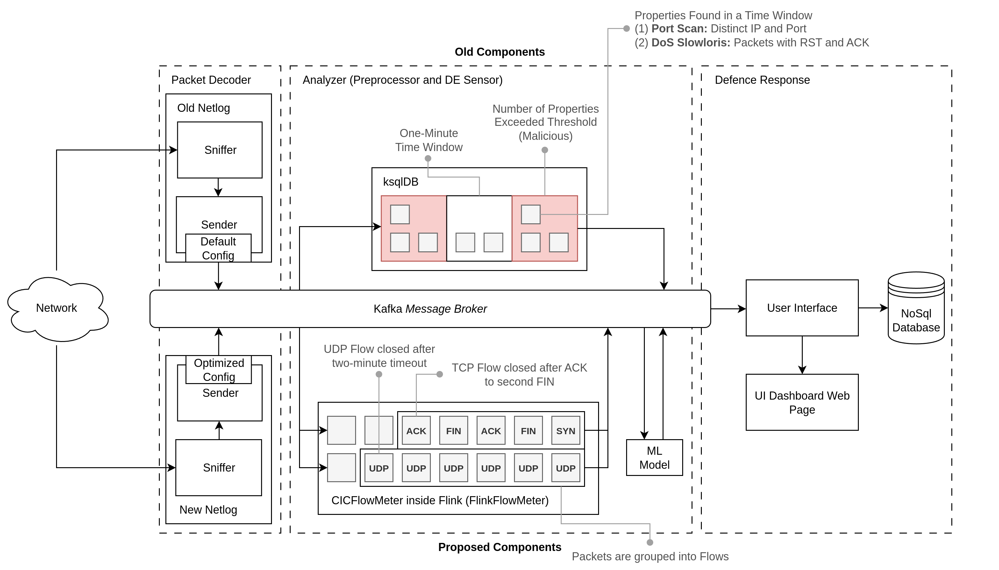

# Netlog IDS

Netlog IDS is an Intrusion Detection System built on Apache Kafka, designed for real-time network traffic analysis. This enhanced version addresses key challenges in the previous system of [Costin (2023)](https://doi.org/10.3390/s23146467) by introducing:

- **Fixed and Optimized Netlog**: Previously, each message sent to Kafka triggered a new connection, severely limiting throughput. This was fixed by reusing connections and tuning Kafka producer configurations `(linger.ms = 120, batch.size = 100MB, compression.type = zstd)`, resulting in up to **81.42%** performance improvement.

- **Machine Learning-Based Detection**: Replaces the rule-based ksqlDB detection with ML models, achieving:

  - **2.69%** F1-score improvement in port scanning detection
  - **71.1–78.35%** F1-score improvement for detecting DoS attacks

- **UI/Monitoring System**: Provides a WebSocket-based real-time dashboard for monitoring detected intrusions. The system is integrated with a MongoDB database to store detection results and metadata, and also includes an email alert system for notifications.

- **End-to-End System Integration**: Combines all key components (packet sniffer, analyzer, and UI) into end-to-end Kafka stream.

## Repositories

- **[New Netlog](https://github.com/NetLog-IDS/netlog-new) (C++):** The repository for the fixed and tuned Netlog. It is used for sniffing packets from network traffic and sending it to Kafka.
- **[Old Netlog](https://github.com/NetLog-IDS/netlog-old) (C++):** The repository for the old Netlog from previous system.
- **[FlinkFlowMeter](https://github.com/NetLog-IDS/FlinkFlowMeter) (Java, Apache Flink, RocksDB):** Integration of [CICFlowMeter](https://github.com/GintsEngelen/CICFlowMeter) with Apache Flink. It is used for extracting connection/flow ML features from packets.
- **[Intrusion Detection](https://github.com/NetLog-IDS/intrusion-detection) (Scikit-Learn, ksqlDB):** The training notebooks, model, and consumer for ML approach are in this repository. ksqlDB queries from the previous system are here too.
- **[UI/Monitoring](https://github.com/NetLog-IDS/monitoring-be) (FastAPI, WebSocket, MongoDB):** Frontend and backend implementation of UI/monitoring service.
- **[Infrastructure](https://github.com/NetLog-IDS/infrastructure) (AWS, Terraform, Docker):** Infrastructure implementation on AWS. It includes Terraform (for production) and Docker Compose (for testing) configuration for deploying the IDS.
